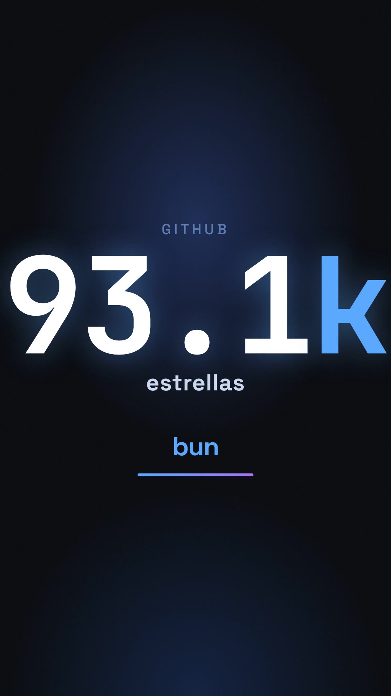

# RepoReel

**Convierte cualquier repositorio de GitHub en un tráiler vertical 9:16 en un clic.**

[](https://reporeel-iota.vercel.app)
[](./LICENSE)
[](#ejecutar-en-local)

---

## Qué hace

Pegas `owner/repo` → RepoReel consulta la **GitHub REST API** en tiempo real (estrellas, lenguajes, commits, contribuidores, último release) → una IA escribe el copy del tráiler → se renderiza un **MP4 cinematográfico 9:16** con HyperFrames → se sirve con OG cards para compartir directamente en TikTok, Reels, Shorts, X y LinkedIn.

**Por qué es diferente:** los datos son reales, no capturas de pantalla. El tráiler incluye una marca de agua con enlace a RepoReel: cada vez que alguien lo comparte trae tráfico de vuelta. Bucle viral nativo.

---

## Demo

**[reporeel-iota.vercel.app](https://reporeel-iota.vercel.app)**

<!-- TODO: demo.gif — grabación del flujo completo (pegar repo → spinner → vídeo) -->

Póster de ejemplo (frame extraído de un render real):



---

## Cómo funciona

```
 ┌──────────────┐
 │  owner/repo  │  (input del usuario)
 └──────┬───────┘
        │
        ▼
 ┌──────────────────────────────┐
 │  GitHub REST API (octokit)   │  stars, lenguajes, commit activity,
 │  adapters/github.ts          │  contribuidores, release, topics
 └──────┬───────────────────────┘
        │
        ▼
 ┌──────────────────────────────┐
 │  Storyboard  (core puro)     │  elige "héroe" (stars / momentum / fresh),
 │  core/storyboard.ts          │  construye 5 beats: hook, identity,
 └──────┬───────────────────────┘  momentum, proof, cta
        │
        ▼
 ┌──────────────────────────────┐
 │  Copy con IA                 │  OpenRouter (llama-3.1-8b-instruct)
 │  adapters/script.ts          │  → fallback determinista si falla
 └──────┬───────────────────────┘
        │
        ▼
 ┌──────────────────────────────┐
 │  Compose vars                │  mapea beats + copy a las variables
 │  adapters/compose.ts         │  de la plantilla HyperFrames
 └──────┬───────────────────────┘
        │
        ▼
 ┌──────────────────────────────┐
 │  Render en Vercel Sandbox    │  microVM Firecracker con snapshot
 │  adapters/render.sandbox.ts  │  pre-horneado (Chromium + FFmpeg)
 └──────┬───────────────────────┘  → out.mp4 + poster.jpg
        │
        ▼
 ┌──────────────────────────────┐
 │  Vercel Blob                 │  almacena MP4 + poster + estado del job
 │  adapters/blob-client.ts     │
 └──────┬───────────────────────┘
        │
        ▼
 ┌──────────────────────────────┐
 │  OG cards + proxy de vídeo   │  og:video / twitter:player
 │  app/r/[owner]/[repo]        │  proxy /v/ y /p/ por el dominio propio
 └──────────────────────────────┘
```

El pipeline se dispara de forma **asíncrona** desde `POST /api/generate` usando `after()` de Next.js 16 (post-response task). El cliente sondea `GET /api/status?jobId=...` hasta que el job pasa a `ready` o `error`.

---

## Arquitectura

El proyecto sigue una **arquitectura hexagonal**: el dominio puro vive en `core/` sin ninguna dependencia de red ni de IA; los adaptadores en `adapters/` conectan ese dominio con los servicios externos.

```
reporeel/
├── core/                       # Dominio PURO (sin red, sin IA, 100% testeable)
│   ├── repo-data.ts            #   Schema Zod de RepoData
│   ├── storyboard.ts           #   Elige el "héroe" y construye los 5 beats
│   └── copy.ts                 #   Copy de respaldo determinista
│
├── adapters/                   # Conexión con servicios externos
│   ├── github.ts               #   GitHub REST vía @octokit/rest
│   ├── script.ts               #   Copy con IA vía OpenRouter (con fallback)
│   ├── compose.ts              #   Mapea storyboard + copy → vars HyperFrames
│   ├── render.sandbox.ts       #   Render MP4 en Vercel Sandbox (Firecracker)
│   ├── sandbox-lib.ts          #   Lógica compartida de microVM (prepare/snapshot)
│   ├── render.mock.ts          #   Mock del render para tests
│   ├── script.mock.ts          #   Mock del copy IA para tests
│   ├── cache.ts                #   Caché de tráileres en Vercel Blob
│   ├── job.ts                  #   Estado del job en Vercel Blob
│   └── blob-client.ts          #   Abstracción de Vercel Blob (inyectable en tests)
│
├── app/                        # Next.js 16 (App Router)
│   ├── page.tsx                #   Landing + galería
│   ├── api/generate/route.ts   #   POST /api/generate — dispara el pipeline
│   ├── api/status/route.ts     #   GET /api/status — sondeo del job
│   ├── r/[owner]/[repo]/       #   Página del tráiler con OG cards (og:video)
│   ├── v/[owner]/[repo]/       #   Proxy de vídeo MP4 por el dominio de la app
│   ├── p/[owner]/[repo]/       #   Proxy del póster JPG por el dominio de la app
│   └── lib/                    #   pipeline.ts, limits.ts, gallery.ts, config.ts…
│
├── compositions/trailer/       # Plantilla HyperFrames 9:16 (1080×1920 · 30 fps · 16.5 s)
│   ├── index.html              #   Composición raíz (orquesta las sub-escenas)
│   ├── meta.json               #   Definición de variables de la plantilla
│   └── compositions/           #   5 escenas HTML standalone con GSAP:
│       ├── hook.html           #     Cifra grande del "héroe" (stars / momentum / fresh)
│       ├── identity.html       #     Lenguajes y descripción
│       ├── momentum.html       #     Gráfica de actividad de commits
│       ├── proof.html          #     Stars, contribuidores, último release
│       └── cta.html            #     Llamada a la acción + install command
│
├── scripts/
│   └── create-snapshot.ts      # Hornea el snapshot del Sandbox en build-time
│
└── tests/
    ├── unit/                   # Vitest: core/, adapters/, app/lib/, proxy/
    └── e2e/                    # Playwright + axe: landing, flujo de generación, accesibilidad
```

---

## Stack

| Capa | Tecnología |
|---|---|
| Framework | Next.js 16 (App Router) |
| Lenguaje | TypeScript 5 (strict) |
| Estilos | Tailwind CSS v4 + shadcn/ui (Base UI) |
| Animaciones del tráiler | HyperFrames + GSAP |
| Render de vídeo | Vercel Sandbox (Firecracker microVM) + FFmpeg |
| Almacenamiento | Vercel Blob |
| GitHub API | @octokit/rest |
| Copy IA | OpenRouter (meta-llama/llama-3.1-8b-instruct) |
| Validación | Zod v4 |
| Tests unitarios | Vitest |
| Tests E2E | Playwright + @axe-core/playwright |

---

## Ejecutar en local

### Requisitos

- Node.js 20+
- pnpm
- Cuenta en [Vercel](https://vercel.com) con plan Pro (necesario para Vercel Sandbox y Blob)

### Instalación

```bash
git clone https://github.com/son1kkesp/reporeel.git
cd reporeel
pnpm install
```

### Variables de entorno

Copia `.env.example` a `.env.local` y rellena los valores:

```bash
cp .env.example .env.local
```

```dotenv
# Obligatorias para el flujo completo:
OPENROUTER_API_KEY=          # Copy con IA (OpenRouter). Sin ella usa el fallback determinista.
GITHUB_TOKEN=                # Token de GitHub (lectura). Sube el rate-limit de la API.
BLOB_READ_WRITE_TOKEN=       # Vercel Blob. Se inyecta automáticamente al desplegar en Vercel.
NEXT_PUBLIC_SITE_URL=        # URL canónica (ej: http://localhost:3000 en local).

# Para el render real en Vercel Sandbox (solo en Vercel; ver .env.example para más detalle):
# VERCEL_OIDC_TOKEN / VERCEL_TOKEN / VERCEL_TEAM_ID / VERCEL_PROJECT_ID
```

> En local, si no configuras el Sandbox, el pipeline usará `adapters/render.mock.ts` como fallback y generará un tráiler de muestra.

### Desarrollo

```bash
pnpm dev          # Servidor de desarrollo en http://localhost:3000
pnpm typecheck    # Comprobación de tipos
pnpm test         # Tests unitarios (Vitest) — 157 tests
pnpm test:e2e     # Tests E2E (Playwright)
```

### Build

```bash
pnpm build        # next build + hornea el snapshot del Sandbox en Vercel
```

El script `scripts/create-snapshot.ts` se engancha al build. En local (sin `VERCEL_DEPLOYMENT_ID`) se omite automáticamente.

---

## Decisiones de ingeniería destacadas

- **Snapshot pre-horneado en build-time.** El Sandbox de Vercel instala Chromium, FFmpeg y HyperFrames en una microVM Firecracker y toma un snapshot al final del `next build`. En cada render posterior se restaura ese snapshot en ~100 ms, en lugar de volver a instalar los ~200 MB de dependencias de sistema en caliente. Sin esto, el stream de salida de Chromium se cortaba antes de terminar (*"Stream ended before command finished"*).

- **Resiliencia del render.** El render se ejecuta vía `sh -c '… > /tmp/render.log 2>&1'` dentro del Sandbox: cualquier crash de Chromium o salida inesperada del proceso queda capturada en ese fichero. Si el SDK lanza sin devolver `result` (stream cortado), se lee igualmente `/tmp/render.log` del Sandbox y su cola se incrusta en `job.error` — el diagnóstico es siempre visible. El ciclo de horneado y el hot-prepare del Sandbox tienen reintentos (`withRetry`, 3 intentos).

- **Proxy de vídeo por el dominio propio.** Las rutas `/v/[owner]/[repo]` y `/p/[owner]/[repo]` sirven el MP4 y el póster a través del dominio de la app, no del host de Vercel Blob. Esto hace que el vídeo cargue incluso en redes corporativas que filtran `*.public.blob.vercel-storage.com`. La respuesta incluye soporte de `Range` (vídeo seekable) y `Cache-Control: immutable` para cacheado en el edge de Vercel.

- **Pipeline asíncrono con `after()`.** `POST /api/generate` responde con `202 Accepted` de inmediato y registra el trabajo pesado con `after()` de Next.js 16. En Vercel, `after()` extiende la vida de la invocación vía `waitUntil` hasta que el render termina (máx. `maxDuration = 300 s`), evitando el bug del antiguo `void runPipeline(...)` que dejaba jobs colgados en `rendering`.

- **Coste y abuso controlados.** Caché de tráileres por repo/día en Vercel Blob (misma entrada → mismo tráiler ese día). Rate-limit por IP: 3 requests/10 minutos en memoria. Semáforo de renders simultáneos (máx. 3). Los vCPUs de la microVM son configurables por env para ajustar el balance RAM/coste.

- **IA que nunca inventa cifras.** El copy de la IA solo recibe los datos numéricos del storyboard (stars, forks, contribuidores…); jamás genera cifras de la nada. Si la llamada a OpenRouter falla, supera el timeout de 15 s o devuelve JSON inválido, `buildFallbackCopy` en `core/copy.ts` produce copy determinista sin red.

- **`core/` 100% testeable sin red ni IA.** Todo el dominio puro (storyboard, copy de respaldo, schema Zod) es una función determinista. Los adapters de red se inyectan en `runPipeline` y se pueden sustituir por fakes en memoria, lo que permite una suite de tests unitarios rápida y sin mocks de red.

---

## Licencia

MIT — ver [LICENSE](./LICENSE).

---

Hecho con precisión por [Cronhaus](https://github.com/son1kkesp) · Iván Barrera
